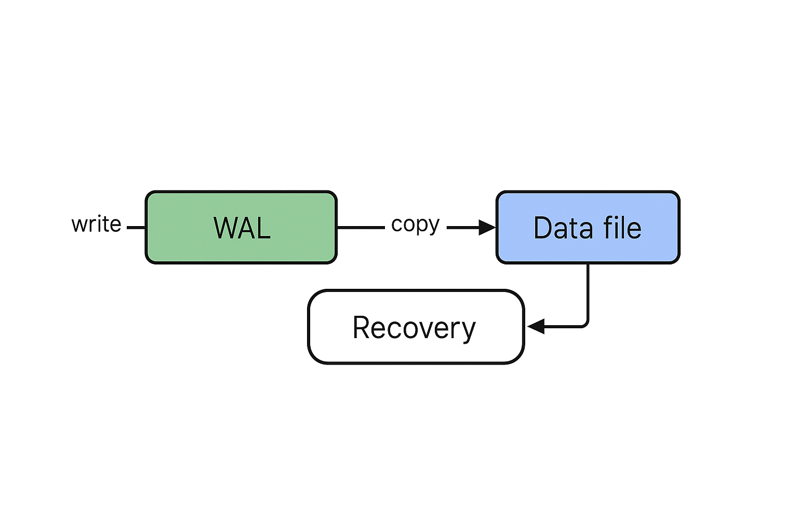

# TinyDB-RS

A crash-safe, write-ahead-logging (WAL) backed **embedded key-value store** written in Rust.  
TinyDB is not production-grade — it’s a **research and learning project** to explore database internals such as WAL, page layout, crash recovery, and durability trade-offs.

---

## ✨ Features

- **Write-Ahead Log (WAL)** for durability: all updates are persisted to WAL before data files.
- **Crash recovery**: on restart, WAL is replayed to restore consistent state.
- **Page-based storage** with CRC checks to detect torn writes / corruption.
- **Fsync durability**: every commit is guaranteed durable on disk.
- **Benchmark harness** to measure per-operation latency and throughput.

---

## 🚀 Getting Started

### Prerequisites
- Rust (≥1.70 recommended)  
- Cargo build system  
- Works on Linux, macOS, and Windows (tested on Windows 11 + Rust stable).

### Build
```bash
git clone https://github.com/<your-username>/tinydb-rs.git
cd tinydb-rs
cargo build --release
```

The compiled binary will be at:
```
target/release/tinydb-rs
```

---

## 📖 Usage

### Create / Set a Key
```bash
cargo run -- set key1 value1
```
Output:
```
OK
```

### Get a Key
```bash
cargo run -- get key1
```
Output:
```
Value: value1
```

### Simulate Recovery
After setting keys, kill the process (simulate crash), then run:
```bash
cargo run -- recovery
```
Output:
```
Recovery complete
```

### Run Built-in Tests
```bash
cargo run -- run_tests
```
Runs a simple crash-recovery test (sets a key, simulates restart, verifies the key still exists).

### Benchmark
Measure throughput and latency for `N` ops:
```bash
cargo run --release -- bench 10000 benchkey 128
```
Example output:
```
ops: 10000
value size: 128 bytes
mean latency (ms): 1.148
p50 (ms): 1.071
p95 (ms): 1.491
p99 (ms): 1.914
throughput (ops/sec): 870.9
bench done
```

---

## 🛠 Internals

TinyDB explores **database internals** often hidden in production systems:

1. **WAL (Write-Ahead Log)**  
   - Every mutation is written to WAL and fsynced before applying to the data file.  
   - Ensures atomicity and durability.

2. **Pages with CRC**  
   - Data is stored in fixed-size pages.  
   - Each page has a CRC32 checksum to detect torn writes or corruption.  

3. **Crash Recovery**  
   - On startup, TinyDB scans the WAL and re-applies operations.  
   - Guarantees consistency even if process crashed mid-write.

4. **Fsync**  
   - Calls `File::sync_all()` after WAL append, ensuring OS buffer flush to disk.  

---

## 🗂️ Architecture



Flow:
- All writes go to the WAL first.  
- WAL entries are fsynced for durability.  
- Pages in the data file are updated from WAL.  
- On crash, recovery replays the WAL to restore consistent state.

---

## 🎯 Intended Uses

- **Educational / learning project** to understand DB internals.  
- **Playground for systems experiments**: WAL batching, group commit, page flushing, checkpointing, etc.  
- **Benchmark harness** for fsync and disk performance exploration.  

> ⚠️ Not intended for production use. TinyDB prioritizes transparency of internals over performance or completeness.

---

## 🧪 Roadmap / Future Work

- [ ] Group commit (batch WAL fsyncs).  
- [ ] Background page flush (remove page sync from commit path).  
- [ ] Checkpoints + WAL truncation for faster recovery.  
- [ ] Concurrency / MVCC experiments.  
- [ ] Formal verification of crash-safety invariants.  

---

## 📜 License

MIT License © 2025 [Your Name]

---

## 🙌 Acknowledgments

Inspired by internals of **PostgreSQL** and **InnoDB** (MySQL), but reimplemented in Rust as a compact learning project.
